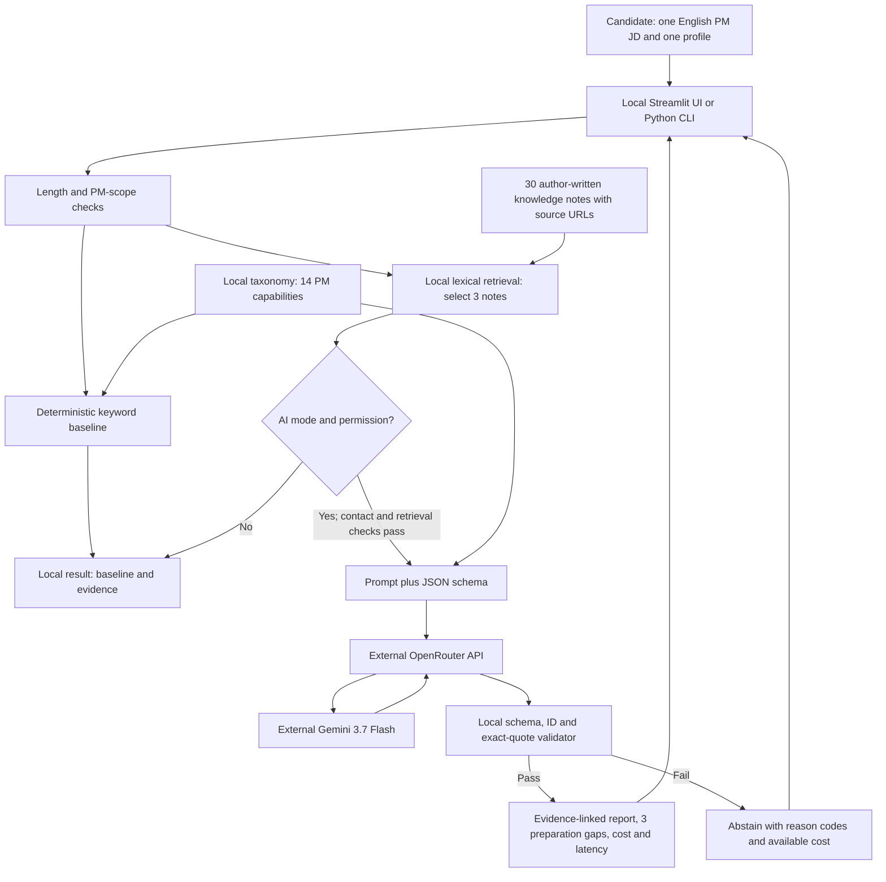

# RoleLens product documentation

## Purpose and persona

RoleLens helps an early-career **AI or commercial product manager** prepare for a role. It compares one job description (JD) with one candidate profile, links the role's requirements to supplied evidence, and proposes three preparation gaps. A gap means that the supplied profile offers limited evidence for an important requirement; it is not proof that the person lacks the ability.

**Primary persona:** Mei is preparing for an AI PM interview in three days. She has product experience but uneven AI-domain exposure. She needs to decide which three topics deserve her next preparation session, and to inspect the evidence behind those priorities. Monetization, subscription and advertising PM candidates are also in scope. The target job is a PM role even when the candidate previously worked in another function.

The intended change is a focused preparation plan rather than an unstructured list of JD keywords. Preparation-time savings and usefulness have not yet been measured. Resume rewriting, automatic applications, hiring recommendations, protected-trait inference, and assessment for engineering or algorithm jobs are outside this prototype's scope.

## Input and output

| Item | Contract |
| --- | --- |
| JD | English text, 80-20,000 characters after trimming. Put a supported product-manager title on the first nonempty line. The title/domain heuristic can reject unusually formatted valid roles. |
| Candidate profile | English evidence bullets or narrative, 30-12,000 characters after trimming. Use fictional data or appropriately authorized, de-identified material. Removing contact details alone does not establish anonymity. |
| Interface | Streamlit accepts pasted text. The CLI reads `.txt`, `.md`, and text-layer `.pdf` files; image-only files need separate local OCR. |
| Local output | Keyword-matched capabilities, source phrases and up to three gap IDs. Fewer than three candidate gaps produces an abstention, although partial baseline information remains visible. |
| AI output | Role summary, responsibilities with JD quotes, capability evidence labeled `strong`, `partial`, or `not_evidenced`, exactly three gaps with preparation actions, local knowledge-note citations, and limitations. |
| Failure output | A visible abstention and reason codes; rejected model calls can still have a cost. |

The AI path sends the JD, profile and three knowledge notes to OpenRouter/Gemini only after explicit external-processing consent. An obvious email/phone detector checks the profile, but does not replace consent or de-identification. API credentials come from the process environment. Ordinary analysis does not save inputs; the evaluation harness separately saves fictional result excerpts for reproducibility.

## Architecture

Text equivalent: **input -> local scope/baseline/retrieval -> permission check -> OpenRouter -> Gemini -> local validation -> report or abstention**. Official source websites provide reading links; this pipeline does not browse them during an analysis. It uses no vector database, trained classifier, automatic tool loop, or external action tool.

### Build versus buy

| Layer | Choice and reason | Main cost or limitation |
| --- | --- | --- |
| Interface | Build a small Streamlit UI using an existing library. It exposes evidence and the baseline alongside results. | Local prototype; no production authentication or multiuser serving design. |
| Orchestration and validation | Own Python code for permission, scope, output contracts, cost reporting and abstention. | Rules need maintenance and cannot establish semantic correctness. |
| Model | Rent `google/gemini-3.7-flash` through OpenRouter, one request per AI analysis. | Provider dependency, token charges and model latency. |
| Retrieval | Own a lexical index over short source-linked notes. It is inspectable and easy to run. | Misses synonyms and has no measured retrieval-quality benchmark. |
| Evaluation | Own frozen fixtures, reference metadata, deterministic metrics and saved run records. | Small synthetic set and shared-author bias limit validity. |

The simple baseline is the measured alternative. Narrow ML was not trained because stable labeled training data is unavailable. The original embedding-retrieval plan was reduced to lexical retrieval for a small corpus and simpler setup. A general chatbot lacks this prototype's reproducible baseline and deterministic evidence contract. A low-code workflow could connect a form to an LLM; Python was chosen to keep the validator and evaluation behavior explicit and versioned. No low-code prototype or measured time-to-deploy comparison is claimed. An agent loop is unnecessary because the task needs one analysis, not autonomous actions.

## Targets and observed results

The proposal targeted at least 80% Top-3 case agreement on 30 held-out cases and at least 20 percentage points above the keyword baseline. Current evidence comes from **ten** fictional pairs and AI-drafted references; the student personally checked and accepted all ten afterward. See [data and evaluation](DATA_AND_EVALUATION.md) for the method and review record.

| Measure | Target or purpose | Keyword baseline | Gemini | Interpretation |
| --- | --- | ---: | ---: | --- |
| At least 2 of 3 reference IDs match | Proposed 80% on 30 held-out cases | 7/10, 70% | 8/10, 80% | The current ten-case AI-reference study does not validate the original human-reference target. |
| Difference from baseline | At least +20 percentage points | Reference | +10 points | Target improvement not reached. |
| Coverage | Measure abstention alongside agreement | 9/10, 90% | 10/10, 100% | Accepted output is not necessarily correct advice. |
| Individual gap overlap, abstention = zero | Supporting diagnostic | 18/30, 60% | 19/30, 63.3% | One additional reference ID matched overall. |
| Median end-to-end latency | Observe usability cost | 12.985 ms | 8,069.285 ms | One small sequential run, not a production benchmark. |
| Response-reported API cost | Observe cost to serve | No external call | US$0.08174175 for ten cases | About US$0.00817 per case; excludes development and human review. |

Among accepted cases only, baseline mean overlap was 2.0/3 versus Gemini's 1.9/3. The model recovered one abstention but did not consistently improve rankings. There is no measured user-benefit, semantic-accuracy, fairness, or deployment-readiness claim.

## File and module guide

| File or module | Role |
| --- | --- |
| `streamlit_app.py` | Pasted-text interface, permission checkbox, evidence display, abstention, model usage. |
| `rolelens/cli.py` | File-based analysis and local private-CV aggregate mode; preserves the original separately gated human-reference evaluator. |
| `rolelens/pipeline.py` | Coordinates input/scope checks, baseline, retrieval, permission, provider and validator. |
| `rolelens/scope.py` | First-line PM-title and AI/commercial-domain heuristics. |
| `rolelens/taxonomy.py` | Fourteen versioned PM capability IDs, keyword aliases and lexical evidence extraction. |
| `rolelens/baseline.py` | Deterministic weighted keyword ranking and baseline abstention. |
| `rolelens/retrieval.py` | Loads notes, filters by role family, scores lexical overlap and selects three. Hybrid roles reserve both families when possible. |
| `rolelens/provider.py` | System prompt, structured JSON schema, single OpenRouter request, token/cost/latency metadata. |
| `rolelens/validation.py` | Checks output shape, valid IDs, exact quotations, citation IDs and three supported gap selections. |
| `rolelens/exploratory.py` | Reproducible exploratory runner, snapshots, atomic result files, safe resume and summaries. |
| `project_core/evidence.py` | SHA-256 data locks and record integrity checks. |
| `project_core/metrics.py` | Shared evaluation utilities; exploratory interpretation is controlled by the exploratory runner. |
| `scripts/build_knowledge_notes.py` | Builds the versioned author-written knowledge-note corpus. |
| `scripts/build_primary_cases_v2.py` | Constructs the fixed fictional JD/profile pairs. |
| `scripts/freeze_dataset.py` | Creates and verifies data locks. |
| `scripts/build_blind_review_v2.py`, `scripts/finalize_blind_review_v2.py` | Original student-review packet/finalization workflow; not used to certify the exploratory results. |
| `tests/test_smoke.py`, `tests/test_exploratory.py` | Offline behavior tests; no live API call or proof of advice quality. |
| `data/`, `results/` | Fixtures, source/reference provenance, protocols and recorded results; explained in `DATA_AND_EVALUATION.md`. |

## Known rough edges and next decisions

- Exact quotations can still be interpreted incorrectly: negation, weak ownership and transfer across domains need semantic checking.
- The first-line scope rule and English lexical retrieval can miss valid roles or useful passages.
- The three real-profile sanity cases were private convenience samples; they do not establish representativeness.
- No product-benefit test was run. A next study should use unseen cases, independent human references and observed preparation decisions.

See the [README](README.md) for setup and runnable commands. This product, code and documentation were developed with Codex assistance; detailed reference provenance is recorded with the evaluation artifacts.
